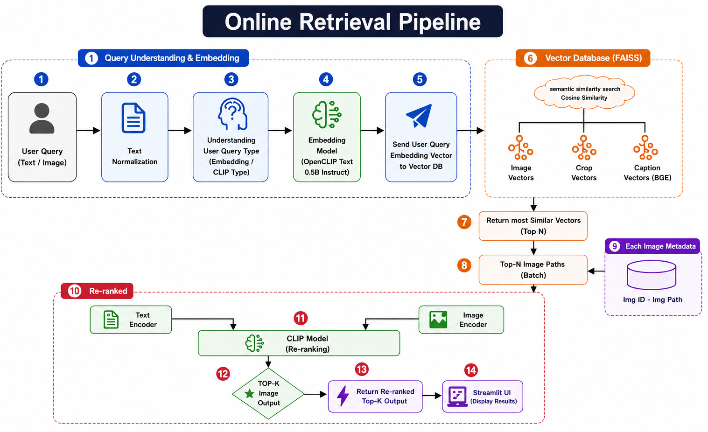
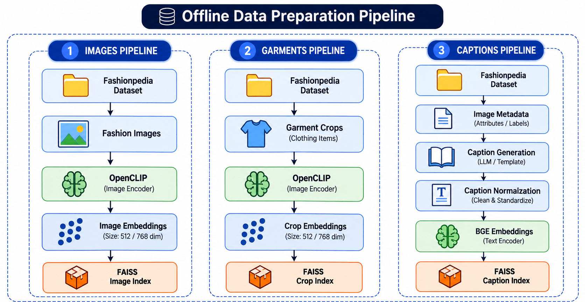

# 👗 Fashion-Retrieval-AI

**Multimodal fashion & context retrieval — search a fashion image collection using natural language, not filenames.**

Fashion-Retrieval-AI is a text-to-image (and image-to-image) search engine built on top of the **Fashionpedia** dataset. It goes beyond a vanilla CLIP similarity search by combining three independent retrieval signals — full-image embeddings, garment-crop embeddings, and normalized-caption embeddings — and fusing + reranking them so that compositional, attribute-heavy queries like *"a red tie and a white shirt in a formal setting"* resolve correctly instead of just matching on the dominant color or object in the frame.

---

## Overview

| | |
|---|---|
| **Input** | Natural language query *or* a reference image |
| **Output** | Top-K matching fashion images, ranked by relevance |
| **Dataset** | [Fashionpedia](https://fashionpedia.github.io/home/) — fashion images with category, attribute, and segmentation annotations |
| **Core idea** | Don't rely on a single CLIP embedding. Search across **whole images**, **garment crops**, and **generated captions** in parallel, fuse the three ranked lists, then rerank the survivors with a cross-encoder that reads the query against the candidate's caption |

This addresses the two weak points a plain zero-shot CLIP search tends to have on fashion queries:

1. **Compositionality** — "red tie, white shirt" vs. "white tie, red shirt" — solved by pairing crop-level embeddings (garment-only, background-free) with query-normalization and cross-encoder reranking against fine-grained captions, rather than trusting a single whole-image CLIP vector to encode attribute-object binding.
2. **Fine-grained attributes** — captions generated per-image/per-crop and embedded with a dedicated text encoder (BGE) capture wording a CLIP text tower alone often misses.

---

## Architecture

The retrieval (query-time) flow:



1. A user submits a **query** (text or image).
2. The query goes through **text normalization** (`parser.py` + `query_normalizer.py`, an LLM rewrite that keeps clothing type, color, accessories, and scene while stripping filler words), then the system determines the **query type** (embedding/CLIP type).
3. The query is embedded with the **OpenCLIP text encoder** and sent as a vector to the **vector database**.
4. FAISS runs a **cosine-similarity search** across the **Image**, **Crop**, and **Caption (BGE)** vector spaces in parallel (`search_engine.py`, `faiss_index.py`), and the three ranked lists are combined via **weighted, min-max normalized score fusion** per `image_id` (`fusion.py`).
5. The most similar vectors (**Top-N**) are resolved back to **image paths** via the image ID → path metadata store.
6. Candidates are **reranked** with a CrossEncoder that scores the query against each candidate's caption, blended with the fusion score (`reranker.py`), to produce the final **Top-K** ranked list, which is returned to the client.

Image-to-image search follows the same idea, skipping the text-specific steps: the uploaded image is embedded with OpenCLIP and matched directly against the image/crop indexes.

---

## Indexing Pipeline

The offline (build-time) flow that turns the raw dataset into the three FAISS indexes above:



| Branch | Steps | Produces |
|---|---|---|
| **Images pipeline** | Fashionpedia Dataset → Fashion Images → OpenCLIP (image encoder) → Image Embeddings | `FAISS Image Index` |
| **Garments pipeline** | Fashionpedia Dataset → Garment Crops → OpenCLIP (image encoder) → Crop Embeddings | `FAISS Crop Index` |
| **Captions pipeline** | Fashionpedia Dataset → Image Metadata → Caption Generation (LLM/template) → Caption Normalization → BGE Embeddings (text encoder) | `FAISS Caption Index` |

Splitting the dataset into three parallel branches is what lets the system separately capture *"what the whole scene looks like"*, *"what an individual garment looks like up close"*, and *"how a person would describe this in words"* — three signals that a single CLIP index tends to blur together.

---

## Project Structure

```
Fashion-Retrieval-AI/
│
├── main.py                     # FastAPI app entrypoint
├── config.py                   # Central config: paths, model names, weights, top-k values
├── requirements.txt
│
├── data/
│   ├── image_annotations.csv   # Fashionpedia annotations (categories, attributes, bboxes)
│   ├── manifest.csv            # Image manifest
│   └── metadata/
│
├── notebook/                   # Build pipeline, one notebook per stage
│   ├── 01_Dataset_Preparation.ipynb
│   ├── 02_Garment_Crop_Extraction.ipynb
│   ├── 03_OpenCLIP_Embedding_Generation.ipynb
│   ├── 04_Long_Caption_Generation.ipynb
│   ├── 05_Caption_Embedding_Generation.ipynb
│   └── 06_Hybrid_Fashion_Retriever.ipynb
│
├── src/
│   ├── models/                 # OpenCLIP / BGE / CrossEncoder loaders (see note below)
│   ├── retrieval/
│   │   ├── parser.py           # Query cleaning
│   │   ├── query_normalizer.py # LLM-based query rewrite (Qwen2.5-0.5B-Instruct)
│   │   ├── faiss_index.py      # Loads & queries the 3 FAISS indexes
│   │   ├── search_engine.py    # Per-index search (image / crop / caption)
│   │   ├── fusion.py           # Weighted, normalized score fusion
│   │   ├── reranker.py         # CrossEncoder reranking
│   │   └── retriever.py        # Orchestrates the full pipeline
│   ├── api/
│   │   ├── routes.py           # /search/text, /search/image
│   │   └── schemas.py          # Request/response models
│   └── utils/
│       ├── image_loader.py
│       └── visualization.py
│
├── indexes/                     # image_index.faiss, crop_index.faiss, caption_index.faiss (generated)
└── outputs/                      # captions/, embeddings/, crop_metadata.csv (generated)
```

> **Note:** `src/models/` (the OpenCLIP / BGE / CrossEncoder loader module referenced throughout `src/retrieval/`) is currently excluded by the top-level `models/` rule in `.gitignore`. Since that pattern isn't anchored, it also matches the nested `src/models/` package. Worth scoping the ignore rule to `/models/` so the loader module actually gets committed.

---

## Tech Stack

| Component | Technology |
|---|---|
| Backend | FastAPI |
| Visual embeddings | OpenCLIP (`ViT-B-32`, `laion2b_s34b_b79k`) |
| Caption embeddings | BGE (`BAAI/bge-large-en-v1.5`) |
| Query normalization | Qwen2.5-0.5B-Instruct |
| Reranking | BAAI CrossEncoder (`bge-reranker-v2-m3`) |
| Vector search | FAISS |
| Image processing | Pillow, OpenCV |
| Deep learning | PyTorch |
| Data handling | Pandas, NumPy |

---

## Getting Started

```bash
git clone https://github.com/nirajg5/Fashion-Retrieval-AI.git
cd Fashion-Retrieval-AI

python -m venv venv
source venv/bin/activate        # Windows: venv\Scripts\activate

pip install -r requirements.txt
```

You'll also need the Fashionpedia dataset (images + annotations) placed under `data/`, matching the paths in `config.py`.

---

## Configuration

All paths, model names, and retrieval hyperparameters live in `config.py`:

```python
OPENCLIP_MODEL      = "ViT-B-32"
OPENCLIP_PRETRAINED = "laion2b_s34b_b79k"
BGE_MODEL            = "BAAI/bge-large-en-v1.5"
RERANKER_MODEL       = "BAAI/bge-reranker-v2-m3"

TOP_K_IMAGE   = 100
TOP_K_CROP    = 100
TOP_K_CAPTION = 100
RERANK_TOP_K  = 50
FINAL_TOP_K   = 10

IMAGE_WEIGHT = 0.45   # + CROP_WEIGHT + CAPTION_WEIGHT (see config.py)
```

Adjust `IMAGE_WEIGHT` / `CROP_WEIGHT` / `CAPTION_WEIGHT` to shift how much the fusion stage trusts scene-level vs. garment-level vs. text-level similarity, and `RERANK_TOP_K` / `FINAL_TOP_K` to trade off reranker latency against recall.

---

## Building the Index

Run the notebooks in `notebook/` in order — each one corresponds to a stage in the [indexing pipeline](#indexing-pipeline):

1. `01_Dataset_Preparation` — load Fashionpedia annotations, build the manifest
2. `02_Garment_Crop_Extraction` — crop individual garments from bounding boxes/segmentation masks
3. `03_OpenCLIP_Embedding_Generation` — embed full images and crops
4. `04_Long_Caption_Generation` — generate a descriptive caption per image/crop
5. `05_Caption_Embedding_Generation` — normalize captions, embed with BGE
6. `06_Hybrid_Fashion_Retriever` — build the three FAISS indexes and sanity-check retrieval end-to-end

This produces `indexes/*.faiss`, the embedding/ID `.npy` files, and the mapping `.csv` files that `src/retrieval/faiss_index.py` loads at startup.

---

## Running the API

```bash
uvicorn main:app --reload
```

Interactive docs: `http://127.0.0.1:8000/docs`

---

## API Reference

### `GET /`
Health check.

```json
{ "status": "running", "service": "Fashion Retrieval API" }
```

### `POST /search/text`

```json
{ "query": "a red tie and a white shirt in a formal setting" }
```

Response:

```json
{
  "original_query": "a red tie and a white shirt in a formal setting",
  "cleaned_query": "a red tie and a white shirt in a formal setting",
  "normalized_query": "red tie, white shirt, formal setting",
  "total_results": 10,
  "results": [
    {
      "image_id": 234,
      "image_path": "...",
      "caption": "White button-down shirt paired with a red tie...",
      "category": "Shirt",
      "supercategory": "upperbody",
      "image_score": 0.81,
      "crop_score": 0.88,
      "caption_score": 0.93,
      "fusion_score": 0.87,
      "rerank_score": 0.95,
      "final_score": 0.92
    }
  ]
}
```

### `POST /search/image`

Multipart upload (`file`) — returns the same result shape, matched via image-to-image search against the image/crop indexes.

---

## Kaggle Notebook

An end-to-end runnable version of this pipeline (dataset prep → embeddings → indexing → retrieval) is also available on Kaggle:

**[fashion-retrieval-ai](https://www.kaggle.com/code/nirajgahukar/fashion-retrieval-ai)**
